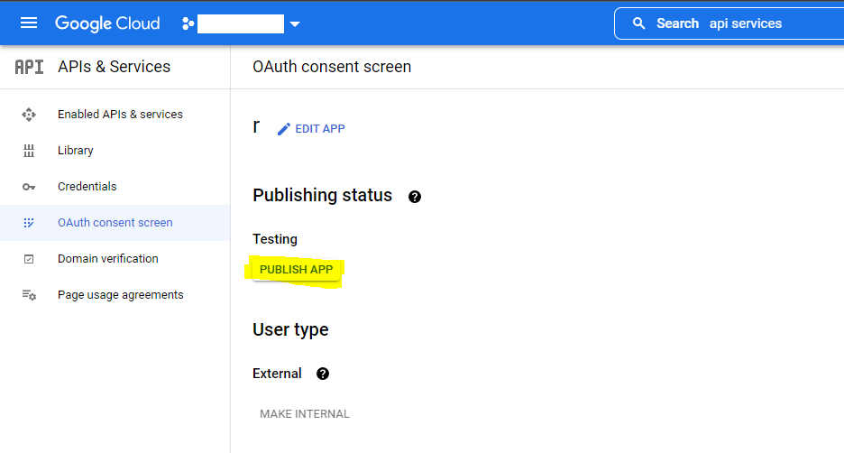
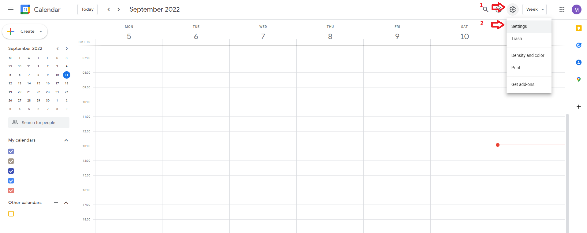

# Google Calendar Configuration

## Google Calendar Authentification

>In this part, you will get:
>
>* your project's ID
>* your OAuth Client ID
>* your OAuth Client Secret
>* your OAuth Refresh Token
>
>Note them down in a notapd window, you will need them later.

To get them, follow these steps:

1. Open [Google Cloud Console](https://console.cloud.google.com/)

**Copy your project ID in your notepad tab by clicking on the button next to "Project ID".**
2. Look for the Google Calendar API and click on it

3. Enable the "Google Calendar API" for your project

4. Look for the "APi & Services" page and click on it to activate the API.

5. Go to OAuth consent scren

6. Select "External type"

7. Fill only the required fields (use your current Google email address when necessary). Then, go next.

8. At the "Scopes" step, verify CAREFULLY that all the 3 scopes categories are empty. Then, go next.

9. At the "Test users" step, add your current Google account among the test users. Then, go next.

10. At the final "Summary" step, verify everything is similar to that screen,  with your email address when necessary. Then, click on "Back to dashboard0"

11. Switch your application in `production` state by clicking on the button

12. Now, it should look like that

Congratulations! You have configured your OAuth consent screen with an application in production state!
From now on, the OAuth refresh token we will get latter will not expire!

Do not close your tab! Now, we just need to get the necessary tokens to interact with the Google Calendar API with no expiration limit!

1. Still in "API & Services", go the the "Credentials" Menu

2. On the "Credentials" page, click on "Create credentials" and then OAuth client ID

3. For application type, select "Web application".
4. Choose a name for this token.
5. Add this URI [https://developers.google.com/oauthplayground](https://developers.google.com/oauthplayground) in the "Authorized redirect URIs" section (be careful not to add a slash at the end). The completed page should look like that:

6. Then click on "Create". It will take you back to the "Credentials" page and the folliwing popup should appear.

**Copy both your Client ID and your Client Secret on a notepad window.** We will need them.

Now, we will go tp the [Google OAuth 2.0 Playground](https://developers.google.com/oauthplayground) to generate a refresh token to human interactions once everything is deployed.

1. Go to the [Google OAuth 2.0 Playground](https://developers.google.com/oauthplayground)
2. Click on the gear icon in the upper-right. Check the `Use your own OAuth credentials` box and input your Client ID and Client Secret

3. On the left side of the screen, under the `Google Calendar API`, select the `https://www.googleapis.com/auth/calendar` OAuth scope and then click `Authorize APIs`.

4. Click "Authorize APIs" and select your Google account or log in.
5. On the warning screen, click on "Show advanced" and then "Go to" at the bottom left of the page.

6. The next screen dexcribe the authorization you grant to the app  using the token. Click on "Continue"

7. Click the "Exchange authorization code for tokens" button

8. It will fill the "Refresh token" and "Access token" fields, and then automatically hide the "Step 2" section and show the "Step 3" section instead. Click back on "Step 2" to go back to the previous step if you did not have enough time to copy it

**Then, copy the "Refresh token" obtained at "Step 2" and paste it in your notepad** with your Client ID and Client Secret.

Congratulations! Now you have your precious Resfresh Token!

Now, we will create a new Google Calendar and use it exclusively for OTGC.

## Create a new Google Calendar

>In this part, you will get:
>
>* your new calendar's ID
>
>Note it down in a notapd window, you will need them later.

Your OnBoard events will be imported on the calendar you specify.
We **recommend** you to create a new calendar (with a non-ambiguous name, such as `ECN`) exclusively for this use, since at each update, all events are deleted before the new import.

To do that:

1. Go to [Google Calendar](https://calendar.google.com/calendar/) and log in.
2. Click on the gear icon in the upper-right corner and then click on settings

3. In the middle of the left panel, click to enlarge the "Add calendar" section and then click on "Create new calendar"

4. Type a name and then click on the blue button "Create calendar"

5. Your calendar has been created. To get its ID, under the section "Settings for my calendars of the left panel", click on your calendar's name.

6. Scroll down a little bit and find the "Calendar ID" sub-section, just under the "Integrate calendar" section.

7. Copy and paste your calendar's ID in your notepad. You will need it latter.

Congratulations! Now, you have everything to upload your OnBoard events in your new Google Calendar!
Go back to the main [README](./README.md#Installation) and choose whever to use OTGC locally or deploy Google ressources to automate everything and no longer manually connect on OnBoard to check your planning and instead use Google Calendar.
