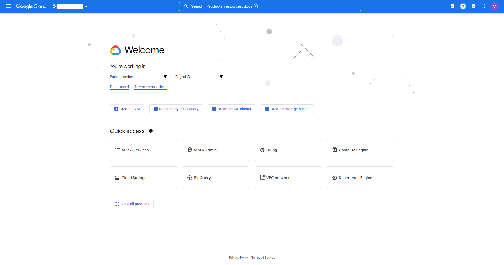
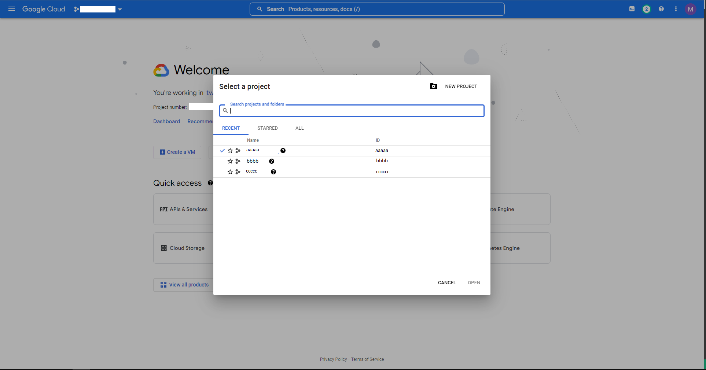
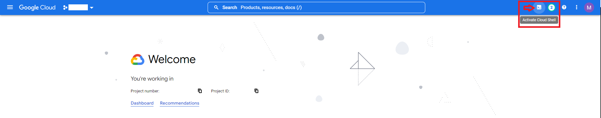

# Deploy with Terraform

> To complete the deployment, you will need:
>
> * your project's ID
> * your OAuth Client ID
> * your OAuth Client Secret
> * your OAuth Refresh Token
> * your new calendar's ID

To easily deploy the GCP resources we need to use OTGC, we will use Terraform.

1. Open [Google Cloud Console](https://console.cloud.google.com/)

2. Click on the project icon and select the Google project you use previously for OTGC

3. Open a [Cloud Shell](https://console.cloud.google.com/home/dashboard?cloudshell=true) inside your project by clicking on the shell icon.

4. Copy this command in the shell input and press ENTER.

```bash
git clone https://github.com/MickaelFontes/otgc.git && cd otgc/terraform
```

5. Then, run the `install.sh` script, by providing it the tokens and IDs pasted in your open notepad window.
To do so, copy the following command and replace the uppercase words with the values in your notepad.
> /!\ The order **matters** !

```bash
./install.sh PROJECT_ID CLIENT_ID CLIENT_SECRET REFRESH_TOKEN CALENDAR_ID ONBAORD_USERNAME ONBOARD_PASSWORD
```
Enter 'yes' when asked by Terraform.
ANJOY
